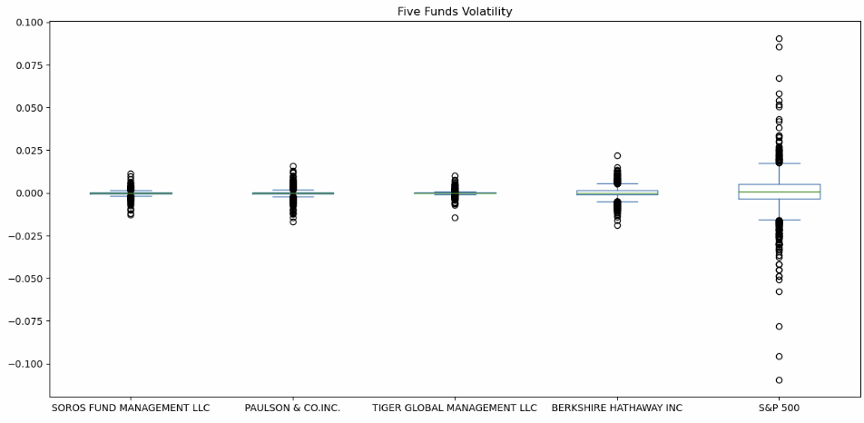

# Risk-return-analysis   
---
In this project, I will work as a quantitative analyst for a FinTech investing platform focused on providing affordable, high-quality online retirement investment solutions.   
My task is to evaluate four new investment funds managed by prominent fund managers using key risk-management metrics   
* daily returns
* standard deviations
* Sharpe ratios
* betas   
I will analyze and determine which fund offers the most investment potential for inclusion in client portfolios. The goal is to help the platform maintain low costs while offering effective investment strategies to its clients.


## Technologies

1. Daily Returns
   1. Daily returns normalized the data into the same scale
   2. Use `Shift(1)` or `pct_change()` to calculated daily returns
   3. If apply to a column, we create a new column, if apply to a dataframe, we create a new dataframe
   4. Calculate accumulative return and accumulative production
2. Risk Management
   1. Calculate std and var
   2. Calculate `Sharpe Ratio`   
      > Sharpe Ratio is used to assess a risk and reward relationship
3. Rolling Data
   1. Calculate 30-day rolling average by using `rolling(window = 30)`
   2. Calculate rolling standard deviation and variance
   3. Calculate rolling beta   
      > Beta is the figure measures how much an assets return value is likely to change relative to the overall market change
---

## Installation Guide

```python
# To run this analysis, you need Pandas, matplotlib libraries from Python
import pandas as pd
import numpy as np
import matplotlib.pyplot as plt
```

---
## Usage

#### Description

  
#### Processing
**Cumulative Returns of four whale funds and S&P 500**   
   
**For whale funds volatility and S&P 500**   
   
**21-day Rolling Average for four whale funds and S&P 500**   
   
**Sharpe Ratio Data Analysis**   
   
**Berkshire Rolling Beta**   


---

## Contributors

Shu Liu   
shu@liu.net

---

## License

MIT License

Copyright (c) 2024 Shu

Permission is hereby granted, free of charge, to any person obtaining a copy
of this software and associated documentation files (the "Software"), to deal
in the Software without restriction, including without limitation the rights
to use, copy, modify, merge, publish, distribute, sublicense, and/or sell
copies of the Software, and to permit persons to whom the Software is
furnished to do so, subject to the following conditions:

The above copyright notice and this permission notice shall be included in all
copies or substantial portions of the Software.

THE SOFTWARE IS PROVIDED "AS IS", WITHOUT WARRANTY OF ANY KIND, EXPRESS OR
IMPLIED, INCLUDING BUT NOT LIMITED TO THE WARRANTIES OF MERCHANTABILITY,
FITNESS FOR A PARTICULAR PURPOSE AND NONINFRINGEMENT. IN NO EVENT SHALL THE
AUTHORS OR COPYRIGHT HOLDERS BE LIABLE FOR ANY CLAIM, DAMAGES OR OTHER
LIABILITY, WHETHER IN AN ACTION OF CONTRACT, TORT OR OTHERWISE, ARISING FROM,
OUT OF OR IN CONNECTION WITH THE SOFTWARE OR THE USE OR OTHER DEALINGS IN THE
SOFTWARE.
